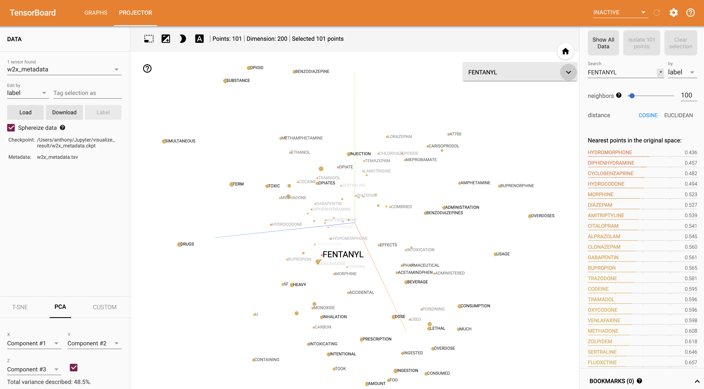

# Word2Vec Embedding Visualizer
Tensors and metadata for Tensorflow word embedding projector using Washington State mortality literal text data from 2016

Shareable URL: [Embedding Projector](https://projector.tensorflow.org/?config=https://gist.githubusercontent.com/alipphardt/9341654aa777b9bf803de0c6e04b0ec5/raw/85ad4bb537b7dfa7116d07e3f4617d2639a654aa/projector-config.json)

